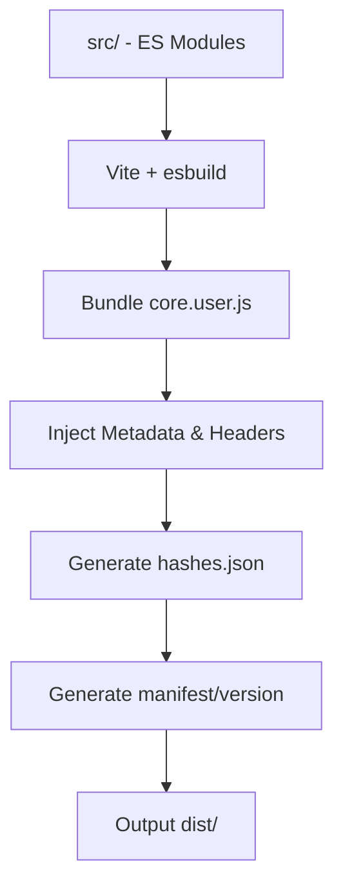
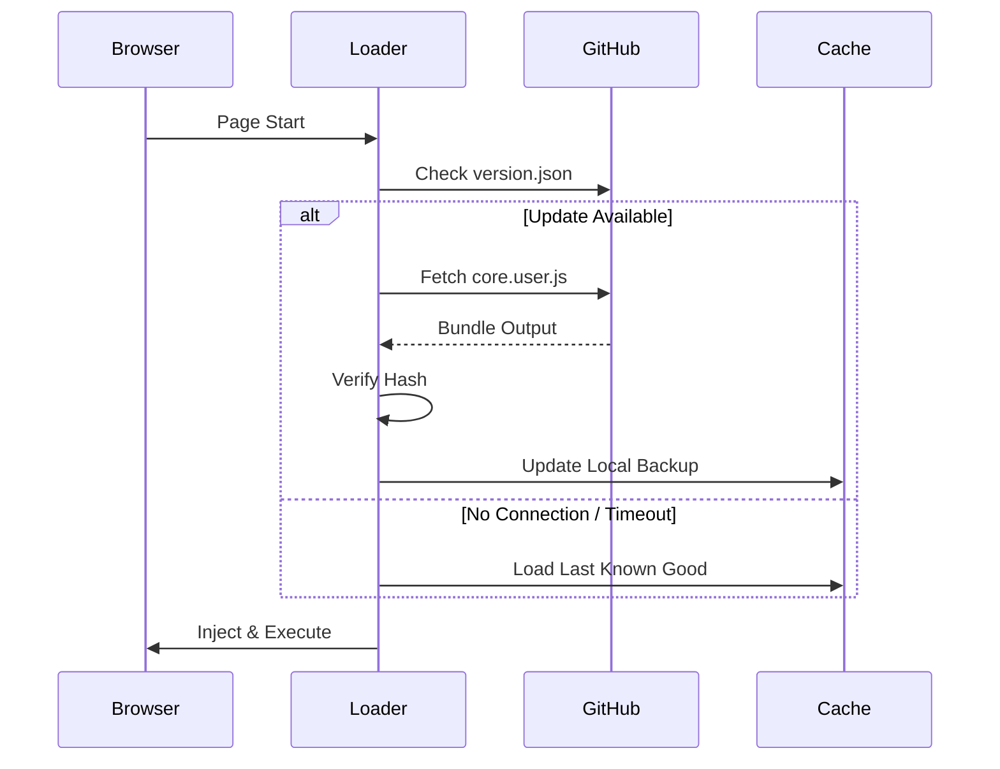

# BintangToba Pro

[](LICENSE)
[](https://vitejs.dev/)
[](https://www.tampermonkey.net/)

BintangToba Pro is a professional-grade, high-performance modular utility suite designed for GeoGuessr. Built on a modern **Modular Architecture**, it provides high-precision coordinate extraction, interactive mapping tools, and advanced session management, all wrapped in a premium "mobile-first" engineering interface.

---

## 1. Project Introduction

BintangToba Pro represents a paradigm shift in userscript development. Moving away from monolithic scripts that are difficult to maintain and audit, this project uses a **hybrid modular-monolith** approach:

*   **Modular Development:** The core logic is split into atomic modules (Geo, Map, UI, Protection) for ease of development and long-term maintainability.
*   **Bundled Production:** Modules are bundled into a single high-performance `core.user.js` using Vite and esbuild, ensuring minimum overhead and maximum compatibility.
*   **Loader-Driven Updates:** A lightweight bootstrap loader handles versioning, integrity checks, and delta updates, reducing the manual overhead of script management.
*   **Protection Layer:** Integrated observation systems ensure runtime stability and script integrity, with automated self-healing for corrupted or modified environments.

---

## 2. Features

*   **🛡️ Runtime Integrity:** SHA-256 verification of the core bundle before execution.
*   **🔄 Auto-Update & Fallback:** Multi-mirror distribution (GitHub RAW/CDN) with 8-second failover.
*   **⏪ Rollback Protection:** Automated local backup of the last known-good bundle.
*   **⚡ Lightweight Loader:** Minimalist bootstrapper (< 5KB) for negligible page load impact.
*   **🧭 Precision Extraction:** Multi-strategy React Fiber walking and XHR interception.
*   **🗺️ Interactive MiniMap:** Feature-rich Leaflet integration with multiple terrain layers.
*   **📜 History Management:** Normalized round tracking with JSON and CSV export/import.
*   **🛠️ Self-Healing:** Automatic detection and re-injection of lost XHR interceptors.
*   **🏗️ Event-Driven:** Optimized lifecycle hooks to prevent memory leaks and redundant listeners.

---

## 3. Installation Tutorial (From Zero)

### Step 1: Install a Compatible Browser
We recommend **Google Chrome**, **Microsoft Edge**, or **Mozilla Firefox** for the best performance.

### Step 2: Install Tampermonkey
1.  Visit [tampermonkey.net](https://www.tampermonkey.net/).
2.  Follow the link to your browser's extension store and click **Add to Chrome/Firefox**.
3.  *(Chrome/Edge Only)*: Go to `Extensions -> Manage Extensions` and enable **Developer Mode** to allow script injection.

### Step 3: Install the BintangToba Loader
1.  Navigate to the [loader.user.js](https://github.com/username/repo/raw/main/loader/loader.user.js) file in this repository.
2.  Tampermonkey will automatically detect the script and open an "Install" tab.
3.  Click the **Install** button.

### Step 4: Verify Installation
1.  Open [GeoGuessr.com](https://www.geoguessr.com).
2.  Check the Tampermonkey icon in your toolbar; it should show a red `1` badge.
3.  Click the icon and ensure "BintangToba Loader" is toggled **ON**.

---

## 4. Development Setup

### Local Environment
Ensure you have [Node.js](https://nodejs.org/) (v18+) installed.

```bash
# Clone the repository
git clone https://github.com/username/repo.git
cd repo

# Install dependencies
npm install

# Start development build
npm run dev

# Build production bundle
npm run build
```

### Project Anatomy
*   `/src`: Core logic and feature modules.
*   `/protection`: Integrity and monitoring systems.
*   `/ui`: Layout, views, and atomic components.
*   `/loader`: The bootstrap userscript.
*   `/scripts`: Build automation and release toolchain.
*   `/dist`: Bundled production artifacts (Gitignored).

---

## 5. Build Pipeline

The project utilizes a custom build flow to transform modular code into a production userscript:



1.  **Vite:** Orchestrates the module graph and provides tree-shaking.
2.  **esbuild:** Minifies the code while preserving Tampermonkey header integrity.
3.  **Automation:** Post-build scripts generate SHA-256 baseline and update version metadata automatically.

---

## 6. Loader Architecture

The **BintangToba Loader** acts as a thin security layer between the browser and the core logic.



*   **Mirror Fallback:** If GitHub RAW is inaccessible, the loader automatically switches to a CDN mirror (jsDelivr).
*   **Rollback Safe:** Corrupted updates are detected and discarded in favor of the local cached backup.

---

## 7. Protection System

Our protection layer is designed for **Runtime Stability** and **Atmospheric Observation** rather than absolute obfuscation.

*   **Integrity Validation:** Periodic checks of the script runtime against the built-in baseline.
*   **Runtime Monitoring:** Specialized `MutationObserver` triggers to detect SPA navigation and DOM changes without interval spam.
*   **Cleanup Lifecycle:** Every module implements `init()` and `destroy()` patterns to ensure zero-leak memory management.
*   **Ownership Registry:** All observers and listeners are registered to a central controller to prevent duplicate execution.

---

## 8. Folder Structure

```text
.
├── dist/                   # Production artifacts (Gitignored)
├── loader/                 # Bootstrap Userscript
│   └── loader.user.js
├── scripts/                # Build & Release scripts
│   ├── build.js
│   ├── hash.js
│   └── manifest.js
├── src/                    # Source Code
│   ├── common/             # Utilities (Storage, Security, Validators)
│   ├── core/               # Global (State, Constants, Logger)
│   ├── features/           # Domain (Geo, Map, History, Address)
│   ├── protection/         # Stability (Integrity, Runtime, Overlay)
│   └── ui/                 # Presentation (Layout, Views, Styles)
├── vite.config.js          # Build configuration
└── package.json            # Project dependencies
```

---

## 9. Troubleshooting

| Issue | Potential Solution |
| :--- | :--- |
| **Script not appearing** | Ensure "Developer Mode" is enabled in browser extensions. |
| **Loader Fail to Fetch** | Check your internet connection or GitHub connectivity; fallback should trigger. |
| **Integrity Warning** | A warning overlay appears if the core script has been modified by another extension. |
| **Old Version Loaded** | Clear browser cache or use the "Reset Cache" button in the Settings view. |
| **Permission Error** | Grant the requested `GM_xmlhttpRequest` permissions when prompted. |

---

## 10. FAQ

**Q: Does it auto-update?**
A: Yes, the loader checks for updates on every page load and fetches the latest bundle from GitHub.

**Q: Why is the loader so small?**
A: To minimize load times. The heavy logic is deferred and loaded asynchronously after the page starts.

**Q: What is the "Protection Layer"?**
A: It ensures that other scripts or browser extensions don't break BintangToba's logic during a game.

---

## 11. Security Notes

Security is a core design pillar. We use **Signature Validation** for every update.
*   **Hash Verification:** Every fetch is verified against a signed hash in `hashes.json`.
*   **Sandbox Isolation:** The loader and core run within protected Tampermonkey sandboxes to prevent interference from website scripts.

---

## 12. License & Usage Restrictions

### Custom Engineering License
This project is provided for **Personal Use Only**.

**Prohibited Actions:**
*   Commercial resale or monetization.
*   Redistribution of modified versions without explicit permission.
*   Usage in scams, fraud, or phishing activities.
*   Bypassing paywalls or paid service restrictions.
*   Malicious modification for malware deployment.

**Usage Restrictions:**
Usage is prohibited for sanctioned individuals, illegal activities, or network abuse. 

*DISCLAIMER: This project is provided "as-is" without warranty of any kind. Use at your own risk.*

---

## 13. Contribution Guidelines

1.  **Modular Coding:** All new features must be implemented as standalone modules.
2.  **Lifecycle Hooks:** Every module must export `init` and `destroy` cleanup handlers.
3.  **Naming:** Use `camelCase` for variables and `kebab-case` for file names.
4.  **Flow:** Maintain a `main -> release` branch flow for stable distribution.

---

## 14. Credits

*   [Tampermonkey](https://www.tampermonkey.net/) - Userscript Manager.
*   [Vite](https://vitejs.dev/) - Frontend Tooling.
*   [Leaflet](https://leafletjs.com/) - Mapping Library.
*   [OpenStreetMap](https://www.openstreetmap.org/) - Map Data.
*   [Nominatim](https://nominatim.org/) - Geocoding.
